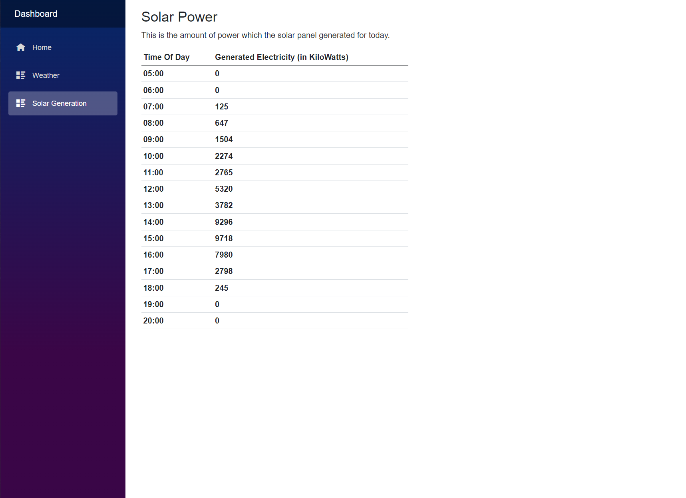
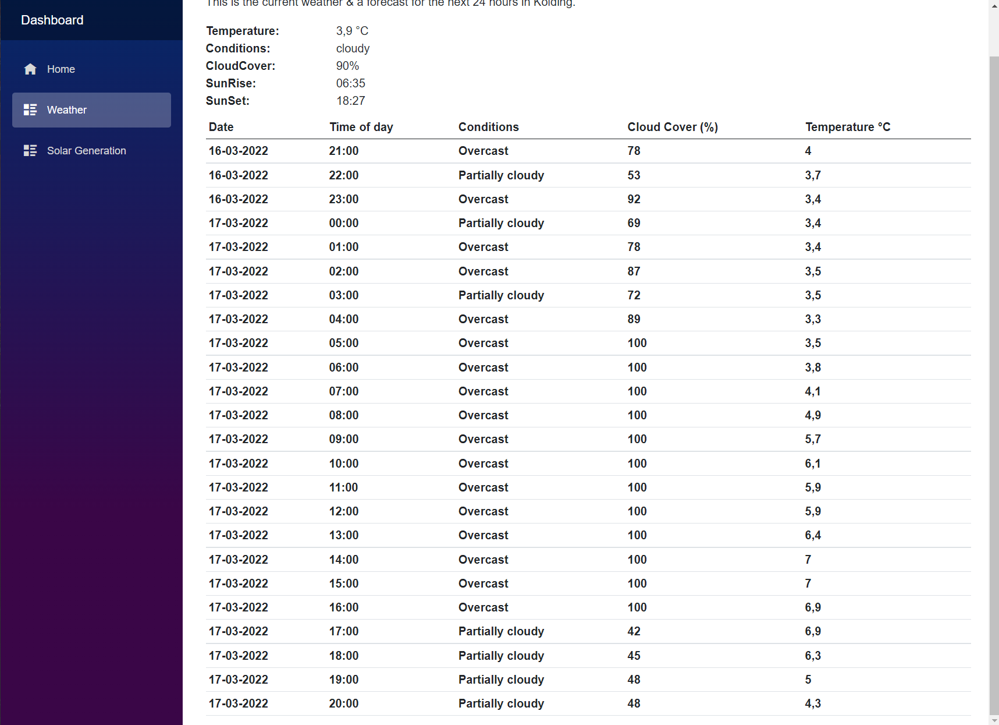
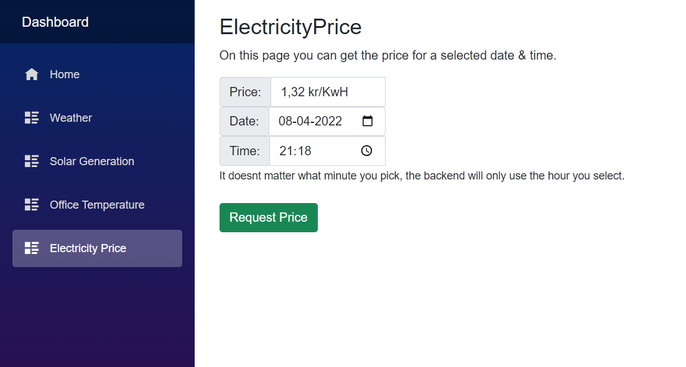

# Diploma.SystemIntegration

A repo to contain all my minor projects for school assignments related to the System Integration course

## Get Going

### **Case del 4 aflevering:**

Efter du har åbnet solution og bygget projektet, så vælg Case.Dashboard som startup project og kør den. Voila!

PS: [Pr dette issue](https://github.com/dotnet/aspnetcore/issues/40189) så kan der være problemer med signalr forbindelsen,
så hvis vejr/strøm siden står og loader, så gå til home og tilbage, så burde dataen være der.

### **Case del 6 aflevering**

**PREREQUISITE:** Du skal have Kafke kørende på port 9092 for at programmet virker! Hvis du ikke har det manuelt installeret og sat op på denne port, kan du istedet installere
Docker Desktop, og derefter køre kommandoen: docker compose up -d i roden af Case.ElectricityService projektet (der hvor docker-compose filen ligger).
Derudover er det vigtigt at du laver 2 topics/køer, en der hedder "get-price" og en der hedder "receive-price". Koden er ikke sat op til selv at lave dem, 
og programmet dør højest sandsynligt hvis de ikke er tilstede!

Sådan kører du programmet:

1. Højreklik på solution og vælg "Set Startup Projects".
2. Vælg "Multiple Startup Projects".
3. Set "Case.Dashboard" og "Case.ElectricityService" til "Start".
4. Kør programmet & Off you go!

