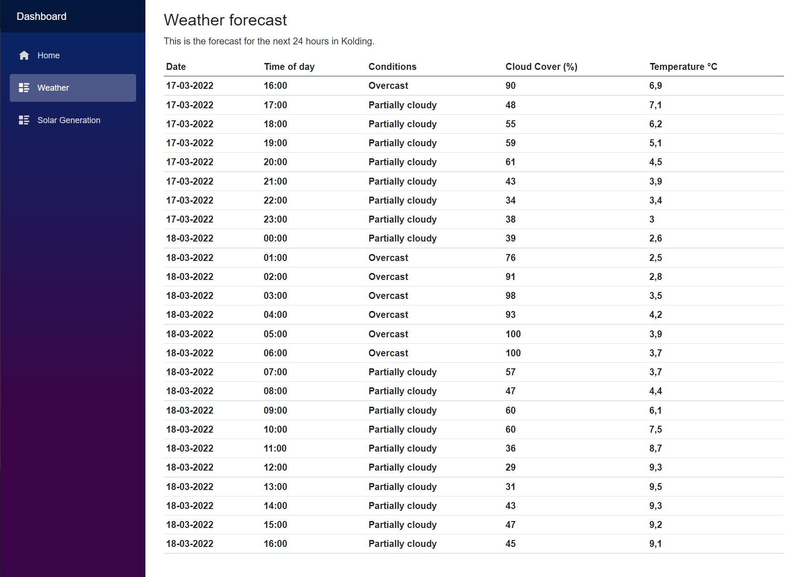

# Diploma.SystemIntegration

A repo to contain all my minor projects for school assignments related to the System Integration course

## Get Going

**Case del 4 aflevering:**

Efter du har �bnet solution og bygget projektet, s� v�lg Case.Dashboard som startup project og k�r den. Voila!

PS: [Pr dette issue](https://github.com/dotnet/aspnetcore/issues/40189) så kan der være problemer med signalr forbindelsen,
så hvis vejr/strøm siden står og loader, så gå til home og tilbage, så burde dataen være der.

